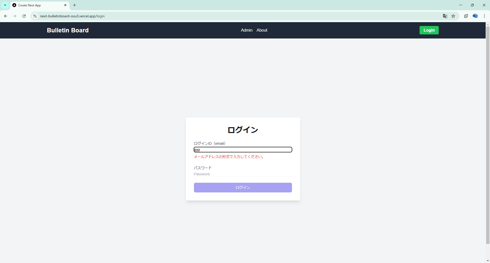

# next-bulletinboard
Next.jsを使った掲示板アプリです。

## 開発経緯など
掲示板アプリは、Webアプリケーションの基本的な機能を学ぶために作成しました。掲示板は、ユーザーが自由に書き込みを行うことができるため、データベースの操作やAPIの作成、管理画面の仕様作成など、Webアプリケーションの基本的な機能を学ぶのに適していると考えました。
また、個人的に理想の掲示板というものをある程度形にしたいという思いもあり、このアプリを作成しました。

- 個人制作
- 期間：2025年1月-2月

## 使用技術
- Next.js
- TypeScript
- Prisma (ORM)
- Supabase (データベース)
- Tailwind CSS (スタイリング)

## 仕様
- **一般的な書き込み機能**
すべての操作は、ユーザー登録無しで実行できます。スレッドを立てて、それぞれに対して書き込みをすることができます。
スレッドを立てる際は、タイトルと最初の書き込みを行います。
- **スレッドの表示**
トップページには、すべてのスレッドが表示されます。スレッドは、タイトル、投稿日時、いいね数を持っています。
スレッドのカードデザインには、個別ページへのリンクといいねボタンがあります。

- **書き込みの表示**
スレッド単位で表示します。そのページで書き込みを行うことができます。書き込みは、投稿日時、ユーザー名、IPアドレス、内容を持っています。IPアドレスは内部で保持されるだけであり、管理画面以外の外部には表示されません。

- **ユーザー名**
ユーザー名（ID）はIPアドレスと日付を元に自動生成されます。ユーザー名は変更できません。また、任意の名前を追加する機能は現時点でありません。
- **管理画面**
管理画面にはログインを行うことでアクセスできます。管理画面では、以下のことができます。
    - すべての書き込みを一覧で表示
    - 特定の書き込みを削除
    - 特定のスレッドを書き込みごと削除
    - タグを追加
    - タグを削除

ログインにはSupabaseの認証機能を使用しています。

## 工夫した点
- スレッドタイトルの「いいね機能」を実装しました。掲示板において最も目を引く部分は、スレッドタイトルであると私は考えています。ユーザーが思わず開きたくなるようなタイトルがどのようなものか、後々まとめることができれば良いと考えました。
- タグ機能を追加しました。スレッドにタグをつけることで、特定のカテゴリに絞り込むことができます。タグは、スレッド作成時に追加することができます。
- 管理画面を作成しました。管理画面では、IPアドレスを含むすべての書き込みを一覧で表示し、削除することができます。記録されているIPアドレスを確認することができます。

### スレッドと書き込みの保存形式
それぞれの書き込みは、スレッドとの直接的な関連性はありません。書き込みはスレッドのIDを持っており、それに基づいてスレッドに紐づいていると見なされます。

### API一覧
'api/admin/'直下は、管理画面用のエンドポイントです。

| メソッド | エンドポイント          | 説明                     |
|----------|-------------------------|--------------------------|
| GET      | /api/threads            | すべてのスレッドを取得   |
| GET      | /api/posts/:id          | 特定のスレッドの書き込みを取得 |
| POST     | /api/posts/:id/new  | 特定のスレッドに書き込みを作成 |
| GET      | /api/tags               | すべてのタグを取得       |
| POST     | /api/threads/new        | 新しいスレッドを作成 |
| PUT      | /api/threads/:id   | スレッドにいいねをする |
| GET      | /api/admin/posts   | IP込みで、すべての書き込みを取得 |
| POST     | /api/admin/tags   | 新しいタグを作成 |
| DELETE   | /api/admin/posts/:id   | 特定の書き込みを削除 |
| DELETE   | /api/admin/threads/:id   | 特定のスレッドを、書き込みを含めて削除 |
| DELETE   | /api/admin/tags/:id   | 特定のタグを削除 |

## 課題
- ユーザー名の関連機能について、追加の余地がある。
- スレッドの個別ページにおいて、ページネーションに類似する機能の実装が必要。
- WebSocketsを使った、いいね数のリアルタイム通信の実装。
